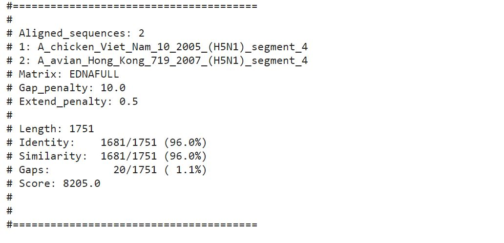
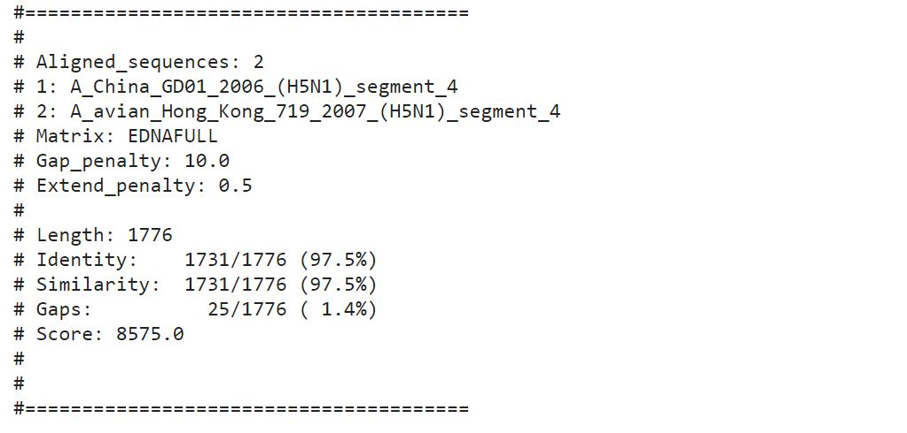

#### Name: Andre Hance
#### Date: 29 March 2021
#### What this is: Questions in blue from the assignment sheet.

#### Part 1.


  1. Which software did you use to conduct your analysis?

    * I used both bpAlign_codingInClass.py and the online interactive demo to compare s1.fasta and s2.fasta.


  2. How similar were the two sequences (`s1.fasta` and `s2.fasta`) which you applied an alignment program?

    * On the bioPython program the sequences received a score of 49 on both local and global alignment, and on the online interactive demo, they received a score of 1 with it's default (match = 1, mismatch = -1, gap = -2) penalties. However the online demo had a cap of around 20 characters meaning it was not able to compute the full sequences. Therefore I will be using the results from the bioPython program made from class to conduct analysis.


  3. Are the two sequences closely related to each other, in your opinion?

    * I think that the sequences are pretty closely related as there is a large part of them that is identical without any gaps, its only really at the ends that there are gaps.

  4. What proof do you have to suggest such a claim?

    * There are a lot of results that look very similar to this one, and its visible that the uninterrupted segments in show a large section of sequence identical between the two.


###### A result from the bioPthon program

```
    atttggctacatttcacagtattcactgagactcattgatgctatgatgttcacatctg----------
|          ||||||||||||||||||||||||||||||||||||||||||||||||
a----------tttcacagtattcactgagactcattgatgctatgatgttcacatctgatttggctac
  Score=49
```


#### Part 2
 1. How much similarity exists between each of the sequences to the others?

    * The similarity varies between 95.2%  to 97.5% between the sequences,
      - A_China_GD01_2006_(H5N1).. and A_avian_Hong_Kong_719_2007_(H5N1).. having a 97.5% similarity
      - A_chicken_Viet_Nam_10_2005_(H5N1).. and A_avian_Hong_Kong_719_2007_(H5N1).. having a 96% similarity
      - A_chicken_Viet_Nam_10_2005_(H5N1).. and A_China_GD01_2006_(H5N1).. having a 95.2% similarity


 2. Based on your results so far (which are too few to provide a comprehensive study), do you believe there is evidence that human adaptation is occurring in H5N1 viruses that might merit concern about human-to-human transmission in the near future?

    * Given that the viruses are very similar (>95%) to each other, based off of that limited information I believe that there isn't much evidence of human adaptation. If there was human adaptation in the viruses then they're would be more differences in the sequences.


 3. Statistics: What were the numbers of Lengths, Similarities, Gaps and Scores for each of your alignment tasks?

    * A_China_GD01_2006_(H5N1).. and A_avian_Hong_Kong_719_2007_(H5N1)..
      - Length: 1776
      - Similarities: 1731/1776 (97.5%)
      - Gaps: 25/1776 (1.4%)
      - Score: 8575.0
    * A_chicken_Viet_Nam_10_2005_(H5N1).. and A_avian_Hong_Kong_719_2007_(H5N1)..
      - Length: 1751
      - Similarities: 1681/1751 (96.0%)
      - Gaps: 20/1751(1.1%)
      - Score: 8205.0
    * A_chicken_Viet_Nam_10_2005_(H5N1).. and A_China_GD01_2006_(H5N1)..
      - Length: 1776
      - Similarities: 1690/1776 (95.2%)
      - Gaps: 45/1776 (2.5%)
      - Score: 8286.0

#### Screenshots:








(Did you remember to add your name to this Markdown file?)
